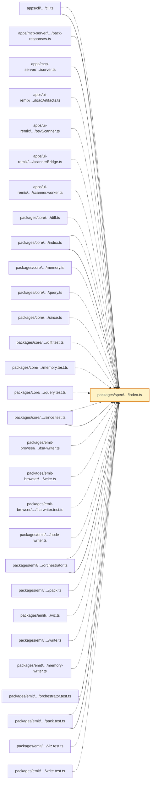

```mermaid
flowchart LR
  n_packages_spec_src_index_ts["packages/spec/…/index.ts"]
  style n_packages_spec_src_index_ts fill:#fef3c7,stroke:#d97706,stroke-width:2px
  n_apps_cli_src_cli_ts["apps/cli/…/cli.ts"]
  n_apps_mcp_server_src_pack_responses_ts["apps/mcp-server/…/pack-responses.ts"]
  n_apps_mcp_server_src_server_ts["apps/mcp-server/…/server.ts"]
  n_apps_ui_remix_src_lib_loadArtifacts_ts["apps/ui-remix/…/loadArtifacts.ts"]
  n_apps_ui_remix_src_lib_osvScanner_ts["apps/ui-remix/…/osvScanner.ts"]
  n_apps_ui_remix_src_lib_scannerBridge_ts["apps/ui-remix/…/scannerBridge.ts"]
  n_apps_ui_remix_src_scanner_worker_ts["apps/ui-remix/…/scanner.worker.ts"]
  n_packages_core_src_diff_ts["packages/core/…/diff.ts"]
  n_packages_core_src_index_ts["packages/core/…/index.ts"]
  n_packages_core_src_memory_ts["packages/core/…/memory.ts"]
  n_packages_core_src_query_ts["packages/core/…/query.ts"]
  n_packages_core_src_since_ts["packages/core/…/since.ts"]
  n_packages_core_test_diff_test_ts["packages/core/…/diff.test.ts"]
  n_packages_core_test_memory_test_ts["packages/core/…/memory.test.ts"]
  n_packages_core_test_query_test_ts["packages/core/…/query.test.ts"]
  n_packages_core_test_since_test_ts["packages/core/…/since.test.ts"]
  n_packages_emit_browser_src_fsa_writer_ts["packages/emit-browser/…/fsa-writer.ts"]
  n_packages_emit_browser_src_write_ts["packages/emit-browser/…/write.ts"]
  n_packages_emit_browser_test_fsa_writer_test_ts["packages/emit-browser/…/fsa-writer.test.ts"]
  n_packages_emit_src_node_writer_ts["packages/emit/…/node-writer.ts"]
  n_packages_emit_src_orchestrator_ts["packages/emit/…/orchestrator.ts"]
  n_packages_emit_src_pack_ts["packages/emit/…/pack.ts"]
  n_packages_emit_src_viz_ts["packages/emit/…/viz.ts"]
  n_packages_emit_src_write_ts["packages/emit/…/write.ts"]
  n_packages_emit_test_helpers_memory_writer_ts["packages/emit/…/memory-writer.ts"]
  n_packages_emit_test_orchestrator_test_ts["packages/emit/…/orchestrator.test.ts"]
  n_packages_emit_test_pack_test_ts["packages/emit/…/pack.test.ts"]
  n_packages_emit_test_viz_test_ts["packages/emit/…/viz.test.ts"]
  n_packages_emit_test_write_test_ts["packages/emit/…/write.test.ts"]
  n_apps_cli_src_cli_ts -.-> n_packages_spec_src_index_ts
  n_apps_cli_src_cli_ts --> n_packages_spec_src_index_ts
  n_apps_mcp_server_src_pack_responses_ts -.-> n_packages_spec_src_index_ts
  n_apps_mcp_server_src_server_ts --> n_packages_spec_src_index_ts
  n_apps_ui_remix_src_lib_loadArtifacts_ts -.-> n_packages_spec_src_index_ts
  n_apps_ui_remix_src_lib_osvScanner_ts -.-> n_packages_spec_src_index_ts
  n_apps_ui_remix_src_lib_scannerBridge_ts -.-> n_packages_spec_src_index_ts
  n_apps_ui_remix_src_scanner_worker_ts -.-> n_packages_spec_src_index_ts
  n_packages_core_src_diff_ts -.-> n_packages_spec_src_index_ts
  n_packages_core_src_index_ts -.-> n_packages_spec_src_index_ts
  n_packages_core_src_index_ts --> n_packages_spec_src_index_ts
  n_packages_core_src_memory_ts -.-> n_packages_spec_src_index_ts
  n_packages_core_src_query_ts -.-> n_packages_spec_src_index_ts
  n_packages_core_src_since_ts -.-> n_packages_spec_src_index_ts
  n_packages_core_test_diff_test_ts -.-> n_packages_spec_src_index_ts
  n_packages_core_test_memory_test_ts -.-> n_packages_spec_src_index_ts
  n_packages_core_test_query_test_ts -.-> n_packages_spec_src_index_ts
  n_packages_core_test_since_test_ts -.-> n_packages_spec_src_index_ts
  n_packages_core_test_since_test_ts --> n_packages_spec_src_index_ts
  n_packages_emit_browser_src_fsa_writer_ts -.-> n_packages_spec_src_index_ts
  n_packages_emit_browser_src_write_ts -.-> n_packages_spec_src_index_ts
  n_packages_emit_browser_test_fsa_writer_test_ts -.-> n_packages_spec_src_index_ts
  n_packages_emit_src_node_writer_ts -.-> n_packages_spec_src_index_ts
  n_packages_emit_src_orchestrator_ts -.-> n_packages_spec_src_index_ts
  n_packages_emit_src_orchestrator_ts --> n_packages_spec_src_index_ts
  n_packages_emit_src_pack_ts -.-> n_packages_spec_src_index_ts
  n_packages_emit_src_viz_ts -.-> n_packages_spec_src_index_ts
  n_packages_emit_src_write_ts -.-> n_packages_spec_src_index_ts
  n_packages_emit_test_helpers_memory_writer_ts -.-> n_packages_spec_src_index_ts
  n_packages_emit_test_orchestrator_test_ts -.-> n_packages_spec_src_index_ts
  n_packages_emit_test_pack_test_ts -.-> n_packages_spec_src_index_ts
  n_packages_emit_test_pack_test_ts --> n_packages_spec_src_index_ts
  n_packages_emit_test_viz_test_ts -.-> n_packages_spec_src_index_ts
  n_packages_emit_test_write_test_ts -.-> n_packages_spec_src_index_ts
```
