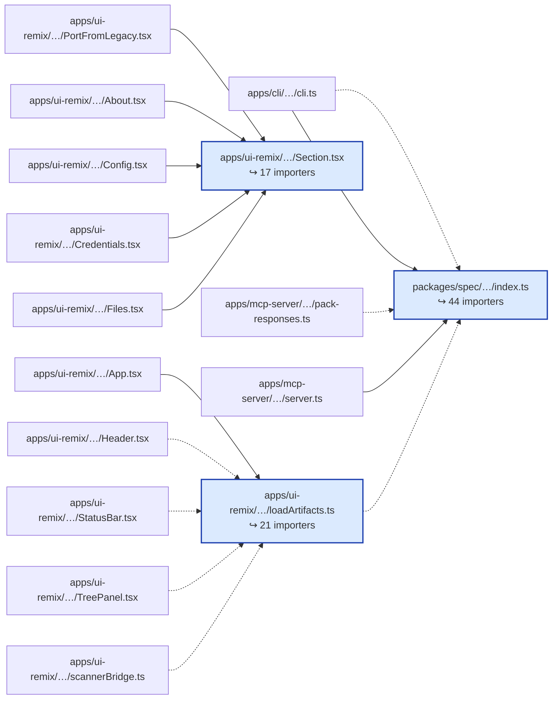

```mermaid
flowchart LR
  n_packages_spec_src_index_ts["packages/spec/…/index.ts<br/>↪ 44 importers"]
  n_apps_ui_remix_src_lib_loadArtifacts_ts["apps/ui-remix/…/loadArtifacts.ts<br/>↪ 21 importers"]
  n_apps_ui_remix_src_ui_Section_tsx["apps/ui-remix/…/Section.tsx<br/>↪ 17 importers"]
  n_apps_cli_src_cli_ts["apps/cli/…/cli.ts"]
  n_apps_mcp_server_src_pack_responses_ts["apps/mcp-server/…/pack-responses.ts"]
  n_apps_mcp_server_src_server_ts["apps/mcp-server/…/server.ts"]
  n_apps_ui_remix_src_App_tsx["apps/ui-remix/…/App.tsx"]
  n_apps_ui_remix_src_components_Header_tsx["apps/ui-remix/…/Header.tsx"]
  n_apps_ui_remix_src_components_StatusBar_tsx["apps/ui-remix/…/StatusBar.tsx"]
  n_apps_ui_remix_src_components_TreePanel_tsx["apps/ui-remix/…/TreePanel.tsx"]
  n_apps_ui_remix_src_lib_scannerBridge_ts["apps/ui-remix/…/scannerBridge.ts"]
  n_apps_ui_remix_src_components_PortFromLegacy_tsx["apps/ui-remix/…/PortFromLegacy.tsx"]
  n_apps_ui_remix_src_routes_About_tsx["apps/ui-remix/…/About.tsx"]
  n_apps_ui_remix_src_routes_Config_tsx["apps/ui-remix/…/Config.tsx"]
  n_apps_ui_remix_src_routes_Credentials_tsx["apps/ui-remix/…/Credentials.tsx"]
  n_apps_ui_remix_src_routes_Files_tsx["apps/ui-remix/…/Files.tsx"]
  n_apps_cli_src_cli_ts -.-> n_packages_spec_src_index_ts
  n_apps_cli_src_cli_ts --> n_packages_spec_src_index_ts
  n_apps_mcp_server_src_pack_responses_ts -.-> n_packages_spec_src_index_ts
  n_apps_mcp_server_src_server_ts --> n_packages_spec_src_index_ts
  n_apps_ui_remix_src_lib_loadArtifacts_ts -.-> n_packages_spec_src_index_ts
  n_apps_ui_remix_src_App_tsx --> n_apps_ui_remix_src_lib_loadArtifacts_ts
  n_apps_ui_remix_src_components_Header_tsx -.-> n_apps_ui_remix_src_lib_loadArtifacts_ts
  n_apps_ui_remix_src_components_StatusBar_tsx -.-> n_apps_ui_remix_src_lib_loadArtifacts_ts
  n_apps_ui_remix_src_components_TreePanel_tsx -.-> n_apps_ui_remix_src_lib_loadArtifacts_ts
  n_apps_ui_remix_src_lib_scannerBridge_ts -.-> n_apps_ui_remix_src_lib_loadArtifacts_ts
  n_apps_ui_remix_src_components_PortFromLegacy_tsx --> n_apps_ui_remix_src_ui_Section_tsx
  n_apps_ui_remix_src_routes_About_tsx --> n_apps_ui_remix_src_ui_Section_tsx
  n_apps_ui_remix_src_routes_Config_tsx --> n_apps_ui_remix_src_ui_Section_tsx
  n_apps_ui_remix_src_routes_Credentials_tsx --> n_apps_ui_remix_src_ui_Section_tsx
  n_apps_ui_remix_src_routes_Files_tsx --> n_apps_ui_remix_src_ui_Section_tsx
  style n_packages_spec_src_index_ts fill:#dbeafe,stroke:#1e40af,stroke-width:2px
  style n_apps_ui_remix_src_lib_loadArtifacts_ts fill:#dbeafe,stroke:#1e40af,stroke-width:2px
  style n_apps_ui_remix_src_ui_Section_tsx fill:#dbeafe,stroke:#1e40af,stroke-width:2px
```
