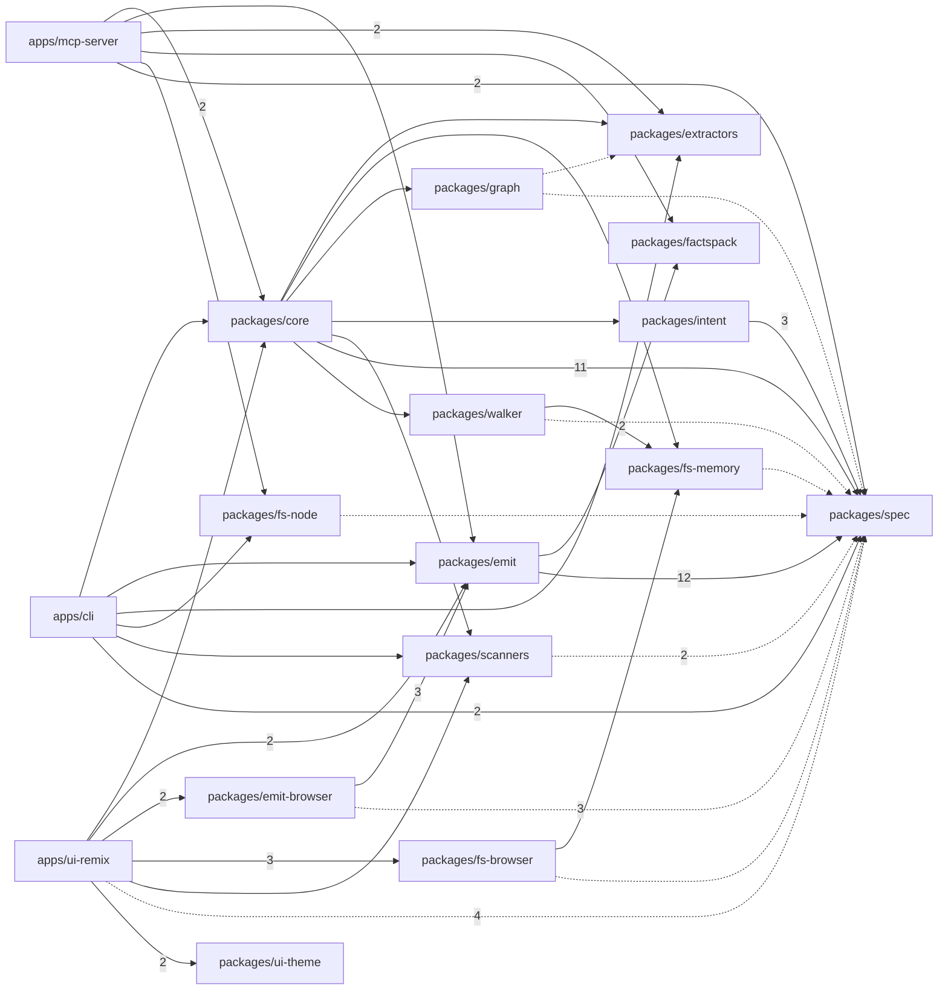

```mermaid
flowchart LR
  n_apps_cli["apps/cli"]
  n_apps_mcp_server["apps/mcp-server"]
  n_apps_ui_remix["apps/ui-remix"]
  n_packages_core["packages/core"]
  n_packages_emit["packages/emit"]
  n_packages_emit_browser["packages/emit-browser"]
  n_packages_extractors["packages/extractors"]
  n_packages_factspack["packages/factspack"]
  n_packages_fs_browser["packages/fs-browser"]
  n_packages_fs_memory["packages/fs-memory"]
  n_packages_fs_node["packages/fs-node"]
  n_packages_graph["packages/graph"]
  n_packages_intent["packages/intent"]
  n_packages_scanners["packages/scanners"]
  n_packages_spec["packages/spec"]
  n_packages_ui_theme["packages/ui-theme"]
  n_packages_walker["packages/walker"]
  n_apps_cli --> n_packages_core
  n_apps_cli --> n_packages_emit
  n_apps_cli --> n_packages_extractors
  n_apps_cli --> n_packages_fs_node
  n_apps_cli --> n_packages_scanners
  n_apps_cli -->|2| n_packages_spec
  n_apps_mcp_server -->|2| n_packages_core
  n_apps_mcp_server --> n_packages_emit
  n_apps_mcp_server -->|2| n_packages_extractors
  n_apps_mcp_server --> n_packages_factspack
  n_apps_mcp_server --> n_packages_fs_node
  n_apps_mcp_server -->|2| n_packages_spec
  n_apps_ui_remix --> n_packages_core
  n_apps_ui_remix -->|2| n_packages_emit
  n_apps_ui_remix -->|2| n_packages_emit_browser
  n_apps_ui_remix -->|3| n_packages_fs_browser
  n_apps_ui_remix --> n_packages_scanners
  n_apps_ui_remix -.->|4| n_packages_spec
  n_apps_ui_remix -->|2| n_packages_ui_theme
  n_packages_core --> n_packages_extractors
  n_packages_core --> n_packages_fs_memory
  n_packages_core --> n_packages_graph
  n_packages_core --> n_packages_intent
  n_packages_core --> n_packages_scanners
  n_packages_core -->|11| n_packages_spec
  n_packages_core --> n_packages_walker
  n_packages_emit -->|2| n_packages_factspack
  n_packages_emit -->|12| n_packages_spec
  n_packages_emit_browser -->|3| n_packages_emit
  n_packages_emit_browser -.->|3| n_packages_spec
  n_packages_fs_browser --> n_packages_fs_memory
  n_packages_fs_browser -.-> n_packages_spec
  n_packages_fs_memory -.-> n_packages_spec
  n_packages_fs_node -.-> n_packages_spec
  n_packages_graph -.-> n_packages_extractors
  n_packages_graph -.-> n_packages_spec
  n_packages_intent -->|3| n_packages_spec
  n_packages_scanners -.->|2| n_packages_spec
  n_packages_walker --> n_packages_fs_memory
  n_packages_walker -.-> n_packages_spec
```
